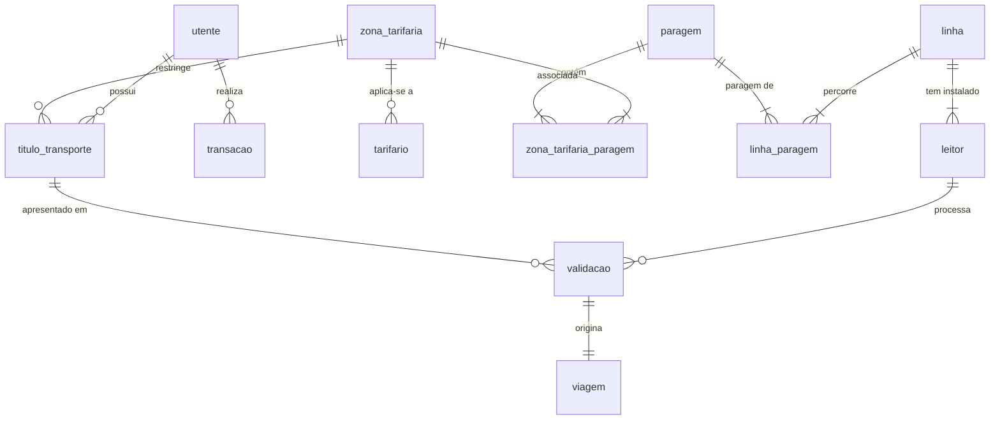

# Estrutura da Base de Dados (Schema)

Este documento descreve a estrutura das tabelas da base de dados do projeto **Bilhética (PEA-solo)**, incluindo colunas, tipos de dados e os seus relacionamentos.

---

## 🗺️ Diagrama Entidade-Associação (ER)

---

## 🗂️ Tabelas da Base de Dados

### 1. `utente`
Guarda as informações de perfil, credenciais e saldo dos utilizadores.
*   **`id`** (`uuid`): Chave Primária (PK).
*   **`nome`** (`character varying`): Nome do utilizador.
*   **`email`** (`character varying`): Email único de login.
*   **`password_hash`** (`character varying`): Hash de segurança da senha.
*   **`telemovel`** (`character varying`, nullable): Contacto telefónico.
*   **`perfil`** (`character varying`): Tipo de perfil (`NORMAL`, `ESTUDANTE`, `SENIOR`).
*   **`saldo`** (`numeric`): Saldo monetário atual da carteira virtual.
*   **`version`** (`bigint`): Controlo de concorrência optimista (JPA).

### 2. `titulo_transporte`
Representa os passes, packs de viagens ou bilhetes adquiridos pelos utilizadores.
*   **`id`** (`uuid`): Chave Primária (PK).
*   **`tipo_titulo`** (`character varying`): Tipo do título (`BILHETE`, `PACK`, `PASSE`).
*   **`estado`** (`character varying`): Estado (`ATIVO`, `EXPIRADO`, `CANCELADO`).
*   **`token_ativo`** (`character varying`, nullable): Token dinâmico/QR Code ativo para validação.
*   **`token_expira_em`** (`timestamp`, nullable): Data/Hora em que o token dinâmico atual expira.
*   **`validade`** (`date`, nullable): Data limite de expiração do passe/bilhete.
*   **`viagens_restantes`** (`integer`, nullable): Número de viagens disponíveis (apenas para `PACK`).
*   **`utente_id`** (`uuid`): Chave Estrangeira (FK) ref. `utente(id)`.
*   **`zona_id`** (`uuid`, nullable): Chave Estrangeira (FK) ref. `zona_tarifaria(id)`.
*   **`version`** (`bigint`): Controlo de concorrência (JPA).

### 3. `transacao`
Regista os movimentos monetários (carregamentos e débitos) nas carteiras dos utilizadores.
*   **`id`** (`uuid`): Chave Primária (PK).
*   **`tipo`** (`character varying`): Tipo de movimento (`CARREGAMENTO`, `DEBITO`).
*   **`valor`** (`numeric`): Montante do movimento.
*   **`descricao`** (`character varying`, nullable): Descrição livre da transação.
*   **`momento`** (`timestamp`): Data/Hora da transação.
*   **`utente_id`** (`uuid`): Chave Estrangeira (FK) ref. `utente(id)`.

### 4. `linha`
Define os trajetos de transporte da rede.
*   **`id`** (`uuid`): Chave Primária (PK).
*   **`designacao`** (`character varying`): Nome ou número da rota.
*   **`tipo_transporte`** (`character varying`): Tipo (`AUTOCARRO`, `METRO`).

### 5. `paragem`
Regista as paragens físicas / estações disponíveis.
*   **`id`** (`uuid`): Chave Primária (PK).
*   **`codigo`** (`character varying`): Código único de identificação.
*   **`nome`** (`character varying`): Nome amigável da paragem.
*   **`municipio`** (`character varying`, nullable): Concelho/Município onde se situa.
*   **`latitude`** (`double precision`): Coordenada geográfica de latitude.
*   **`longitude`** (`double precision`): Coordenada geográfica de longitude.

### 6. `linha_paragem`
Tabela de associação de cardinalidade N:M que descreve a sequência de paragens que uma linha percorre.
*   **`linha_id`** (`uuid`): FK ref. `linha(id)` (Parte da PK composta).
*   **`paragem_id`** (`uuid`): FK ref. `paragem(id)` (Parte da PK composta).
*   **`sentido`** (`character varying`): Sentido da marcha (`IDA`, `VOLTA`) (Parte da PK composta).
*   **`sequencia`** (`integer`): Posição de ordenação da paragem na viagem da linha.
*   **`distancia_metros`** (`integer`, nullable): Distância em metros desde a paragem anterior.
*   **`tempo_estimado_seg`** (`integer`, nullable): Tempo de viagem estimado desde a paragem anterior.

### 7. `leitor`
Validador/Torniquete instalado no interior dos veículos ou estações.
*   **`id`** (`uuid`): Chave Primária (PK).
*   **`codigo`** (`character varying`): Código único visível/identificador do leitor.
*   **`estado`** (`character varying`): Estado de operação (`ACTIVO`, `INACTIVO`, `AVARIA`).
*   **`linha_id`** (`uuid`): Chave Estrangeira (FK) ref. `linha(id)`.

### 8. `validacao`
Regista as aproximações de títulos de transporte aos leitores.
*   **`id`** (`uuid`): Chave Primária (PK).
*   **`momento`** (`timestamp`): Data/Hora exata do batimento.
*   **`resultado`** (`character varying`): Resultado da validação (`VALIDO`, `INVALIDO`, `SEM_SALDO`, `FORA_ZONA`, etc.).
*   **`leitor_id`** (`uuid`): Chave Estrangeira (FK) ref. `leitor(id)`.
*   **`titulo_id`** (`uuid`): Chave Estrangeira (FK) ref. `titulo_transporte(id)`.

### 9. `viagem`
Representa um percurso válido gerado a partir de uma validação autorizada.
*   **`id`** (`uuid`): Chave Primária (PK).
*   **`momento`** (`timestamp`): Data/Hora de início do percurso.
*   **`validacao_id`** (`uuid`): Chave Estrangeira (FK) ref. `validacao(id)` (Relacionamento 1:1).

### 10. `zona_tarifaria`
Configurações de limites e coberturas geográficas de zonamento.
*   **`id`** (`uuid`): Chave Primária (PK).
*   **`nome`** (`character varying`): Nome da zona (ex: `Zona A`, `Rede Completa`).
*   **`descricao`** (`character varying`, nullable): Detalhe descritivo.

### 11. `zona_tarifaria_paragem`
Tabela de associação N:M que define quais as paragens que pertencem a cada zona.
*   **`zona_id`** (`uuid`): FK ref. `zona_tarifaria(id)` (PK composta).
*   **`paragem_id`** (`uuid`): FK ref. `paragem(id)` (PK composta).

### 12. `tarifario`
Define a matriz de preços com base no tipo de título, zona e perfil do utente.
*   **`id`** (`uuid`): Chave Primária (PK).
*   **`tipo_titulo`** (`character varying`): Tipo (`BILHETE`, `PACK`, `PASSE`).
*   **`perfil_utente`** (`character varying`): Perfil (`NORMAL`, `ESTUDANTE`, `SENIOR`).
*   **`preco`** (`numeric`): Custo monetário associado.
*   **`zona_id`** (`uuid`, nullable): Chave Estrangeira (FK) ref. `zona_tarifaria(id)`.
